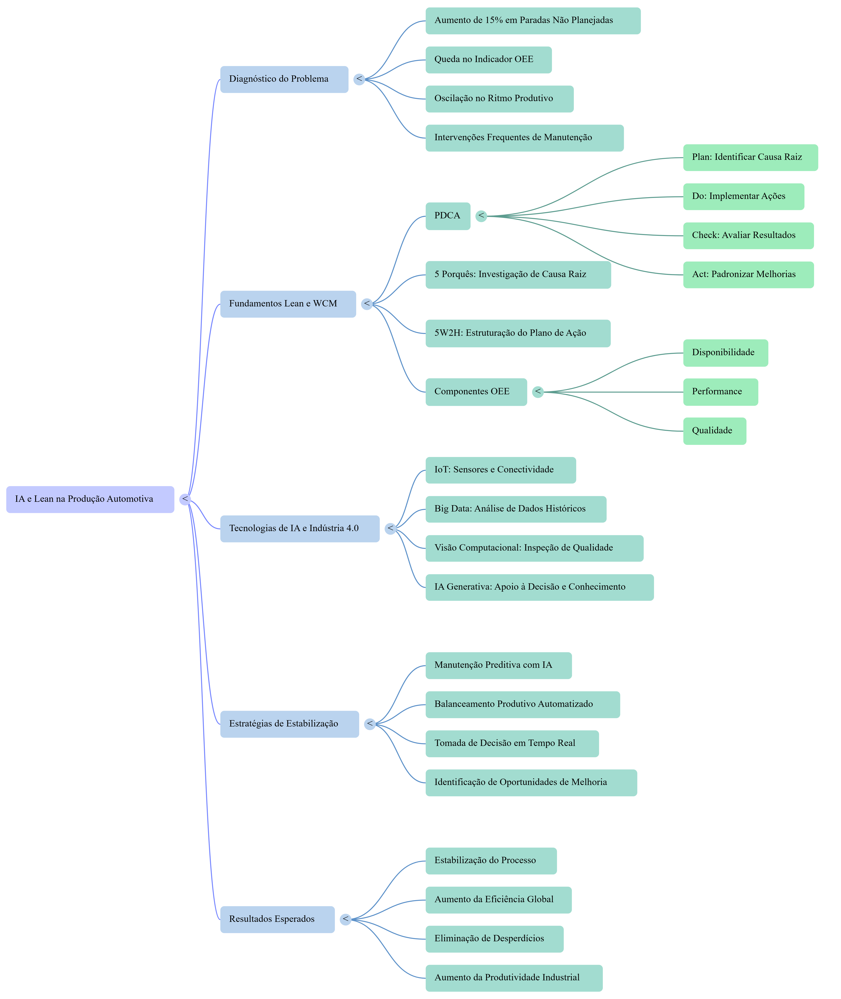

# 🚀 IA Aplicada à Melhoria Contínua

## 📑 Índice

- [📖 Sobre o Projeto](#-sobre-o-projeto)
- [🎯 Objetivos](#-objetivos)
- [🏭 Caso Estudado](#-caso-estudado)
- [🧠 Metodologias Utilizadas](#-metodologias-utilizadas)
- [🤖 Ferramentas Utilizadas](#-ferramentas-utilizadas)
- [📂 Estrutura do Projeto](#-estrutura-do-projeto)
- [🧠 Materiais Desenvolvidos no NotebookLM](#-materiais-desenvolvidos-no-notebooklm)
- [📈 Resultados Obtidos](#-resultados-obtidos)
- [🚀 Competências Desenvolvidas](#-competências-desenvolvidas)
- [💡 Aplicação da Inteligência Artificial](#-aplicação-da-inteligência-artificial)
- [📚 Referências](#-referências)
- [📚 Curadoria de Fontes](#-curadoria-de-fontes)
- [🧠 Engenharia de Prompts](#-engenharia-de-prompts)
- [🔧 Cicatrizes e Aprendizados](#-cicatrizes-e-aprendizados)
- [📖 Miniguia de Estudo](#-miniguia-de-estudo)
- [👨‍💻 Autor](#-autor)

---

## 📖 Sobre o Projeto

Este projeto foi desenvolvido durante a formação da **Digital Innovation One (DIO)** com o objetivo de explorar a aplicação da **Inteligência Artificial Generativa** como ferramenta de apoio à Melhoria Contínua em ambientes industriais.

O estudo demonstra como diferentes ferramentas de IA podem auxiliar profissionais na análise de problemas, organização do conhecimento, identificação de causas raiz e elaboração de planos de ação para aumentar a eficiência operacional.

---

## 🎯 Objetivos

- Demonstrar aplicações práticas da Inteligência Artificial na indústria.
- Integrar conceitos de Lean Manufacturing e World Class Manufacturing (WCM).
- Aplicar metodologias estruturadas de solução de problemas.
- Explorar o uso do NotebookLM como ferramenta de pesquisa e organização do conhecimento.
- Documentar o desenvolvimento do projeto utilizando GitHub.

---

## 🏭 Caso Estudado

Foi utilizado um cenário de uma linha de montagem automotiva com o seguinte problema:

> **Aumento de 15% nas paradas não planejadas**, impactando diretamente o indicador **OEE (Overall Equipment Effectiveness)**.

A análise considera fatores relacionados aos **4Ms**:

- Máquina
- Método
- Mão de Obra
- Material

> **Observação:** O cenário apresentado possui finalidade exclusivamente educacional e foi desenvolvido para demonstrar a aplicação de metodologias de melhoria contínua e Inteligência Artificial em um contexto industrial.

---

## 🧠 Metodologias Utilizadas

- Lean Manufacturing
- World Class Manufacturing (WCM)
- PDCA (Plan, Do, Check, Act)
- 5 Porquês
- 5W2H
- Análise de Causa Raiz
- OEE (Overall Equipment Effectiveness)

---

## 🤖 Ferramentas Utilizadas

- **ChatGPT** — apoio na elaboração das análises e documentação.
- **NotebookLM** — organização das fontes e geração de materiais de estudo.
- **GitHub** — versionamento e documentação do projeto.
- **Markdown** — criação da documentação técnica.

---

## 📂 Estrutura do Projeto

```text
📁 analises
    └── Análises do problema industrial utilizando IA

📁 dados
    └── Cenário utilizado como estudo de caso

📁 docs
    ├── aprendizados.md
    ├── mapa-mental-ia-melhoria-continua.png
    └── infografico-ia-melhoria-continua.png

📁 ferramentas
    └── Biblioteca de prompts para IA

README.md
LICENSE

```

## 🧠 Materiais Desenvolvidos no NotebookLM

Durante o projeto, o **Google NotebookLM** foi utilizado para organizar referências, estruturar o conhecimento e gerar materiais de apoio ao estudo.

Materiais produzidos:

- 🧠 Mapa Mental
- 📊 Infográfico
- 📑 Relatório Técnico

---

## 🧠 Mapa Mental



---

## 📊 Infográfico


---

## 📈 Resultados Obtidos

Durante o desenvolvimento deste projeto foi possível:

- Aplicar conceitos de Lean Manufacturing e WCM em um estudo de caso.
- Utilizar Inteligência Artificial para apoiar a análise de problemas industriais.
- Organizar referências técnicas utilizando o NotebookLM.
- Gerar um mapa mental e um infográfico para facilitar o entendimento do tema.
- Estruturar um repositório no GitHub utilizando Markdown.

---

## 🚀 Competências Desenvolvidas

Ao longo deste projeto foram desenvolvidas e aplicadas competências em:

- Inteligência Artificial aplicada à indústria.
- Lean Manufacturing e World Class Manufacturing (WCM).
- Análise estruturada de problemas utilizando os 4Ms, 5 Porquês e 5W2H.
- Organização e síntese de informações utilizando o NotebookLM.
- Documentação técnica em Markdown.
- Versionamento de projetos com GitHub.
- Comunicação técnica e apresentação de resultados.

---

## 💡 Aplicação da Inteligência Artificial

A Inteligência Artificial foi utilizada para apoiar atividades como:

- Organização das informações técnicas.
- Investigação de causas raiz.
- Estruturação de planos de ação.
- Apoio à tomada de decisão.
- Geração de materiais para estudo.
- Identificação de oportunidades de melhoria contínua.

---

## 📚 Referências

As análises foram desenvolvidas utilizando fontes pesquisadas e organizadas no NotebookLM:

- Fundamentos Lean Manufacturing e WCM.
- Problema Industrial – Linha de Montagem.
- Inteligência Artificial – SENAI.
- SENAI 4.0 – Sistema Indústria.
- OpenAI Developers.
- *Mapping Industry 4.0 Technologies: From Cyber-Physical Systems to Artificial Intelligence*.

---

## 📚 Curadoria de Fontes

As fontes abaixo foram selecionadas e utilizadas no NotebookLM para construção do caderno temático:

1. **Fundamentos Lean Manufacturing e WCM**
   - Base conceitual sobre Lean Manufacturing, eliminação de desperdícios, melhoria contínua e excelência operacional.

2. **Problema Industrial – Linha de Montagem**
   - Cenário utilizado como estudo de caso para análise das causas de perda de eficiência produtiva.

3. **Inteligência Artificial – SENAI**
   - Referência sobre aplicação da Inteligência Artificial no ambiente industrial.

4. **SENAI 4.0 – Sistema Indústria**
   - Conteúdo relacionado à transformação digital, Indústria 4.0 e tecnologias inteligentes.

5. **Mapping Industry 4.0 Technologies: From Cyber-Physical Systems to Artificial Intelligence**
   - Artigo científico utilizado para aprofundamento sobre tecnologias da Indústria 4.0.

---

## 🧠 Engenharia de Prompts

Durante o desenvolvimento do projeto foram realizados testes de prompts no NotebookLM para melhorar a qualidade das respostas geradas.

### Prompt inicial:

> Analise as principais causas para a queda do OEE em uma linha de montagem automotiva.

**Resultado obtido:**
- Identificação inicial das possíveis causas.
- Necessidade de fornecer maior contexto industrial.

### Evolução do prompt:

> Crie uma análise técnica utilizando Lean Manufacturing, WCM, 4Ms, PDCA, 5 Porquês e Inteligência Artificial para solucionar um aumento de 15% nas paradas não planejadas em uma linha de montagem automotiva.

**Resultado obtido:**
- Resposta mais estruturada.
- Maior conexão com o problema industrial.
- Melhor aplicação das metodologias de melhoria contínua.

---

## 🔧 Cicatrizes e Aprendizados

Durante o desenvolvimento do projeto foram identificados alguns desafios:

- Algumas respostas iniciais da IA ficaram genéricas.
- Foi necessário melhorar os prompts para obter análises mais técnicas.
- A qualidade das respostas aumentou após a inclusão de fontes específicas.
- Algumas fontes em inglês exigiram adaptação para o contexto brasileiro.

### Principais aprendizados:

- A qualidade da resposta da IA depende da qualidade do prompt utilizado.
- A curadoria das fontes influencia diretamente o resultado.
- A Inteligência Artificial deve ser utilizada como ferramenta de apoio ao pensamento crítico.

---

## 📖 Miniguia de Estudo

### Resumo

A Inteligência Artificial aplicada à melhoria contínua permite analisar informações industriais, identificar padrões, apoiar a investigação de causas raiz e auxiliar na criação de planos de ação.

A combinação entre IA, Lean Manufacturing, WCM e ferramentas tradicionais de solução de problemas possibilita processos mais eficientes, estáveis e orientados por dados.

### Glossário

**OEE (Overall Equipment Effectiveness)**  
Indicador utilizado para medir a eficiência global de equipamentos considerando disponibilidade, performance e qualidade.

**Lean Manufacturing**  
Filosofia de gestão focada na eliminação de desperdícios e geração de valor.

**WCM (World Class Manufacturing)**  
Modelo de excelência operacional baseado em melhoria contínua e redução de perdas.

**PDCA**  
Método estruturado para planejar, executar, verificar resultados e padronizar melhorias.

**5W2H**  
Ferramenta utilizada para estruturar planos de ação.

**Inteligência Artificial Generativa**  
Tecnologia capaz de gerar conteúdos, análises e auxiliar processos de tomada de decisão.

### Prompts Reutilizáveis

**Análise de causa raiz:**

> Analise este problema industrial utilizando os 4Ms e identifique possíveis causas raiz.

**Plano de ação:**

> Crie um plano 5W2H para eliminar uma perda de eficiência em uma linha de produção.

**Melhoria contínua com IA:**

> Explique como a Inteligência Artificial pode apoiar a melhoria contínua em um processo industrial.

## 👨‍💻 Autor

**Tiago Emanuel Azevedo Costa**

Profissional da indústria automotiva com experiência em liderança operacional, Lean Manufacturing, World Class Manufacturing (WCM), balanceamento produtivo e melhoria contínua.

Projeto desenvolvido durante a formação da **Digital Innovation One (DIO)**.
